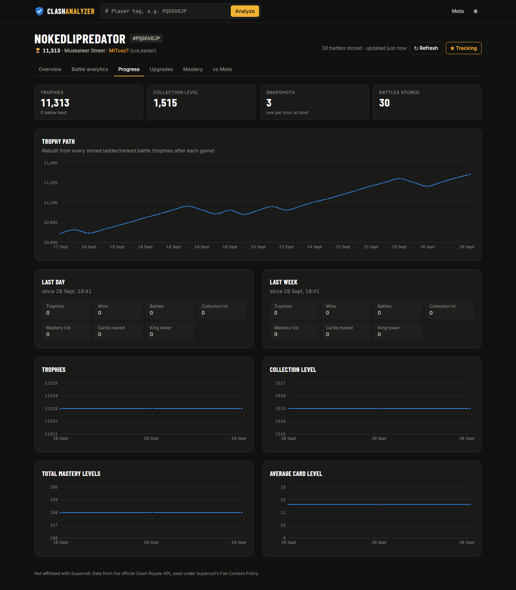
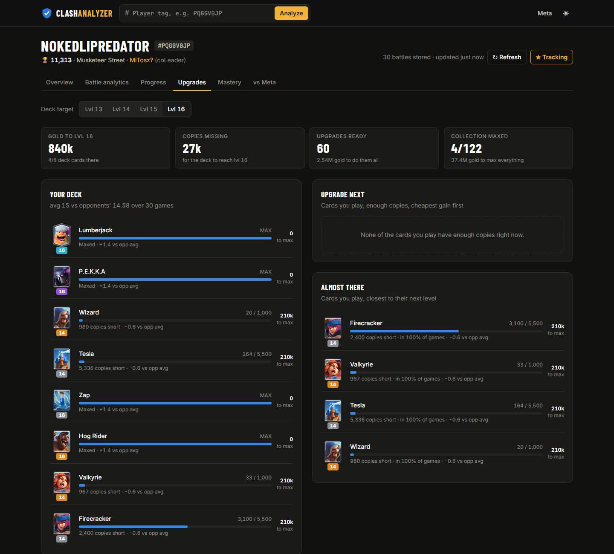
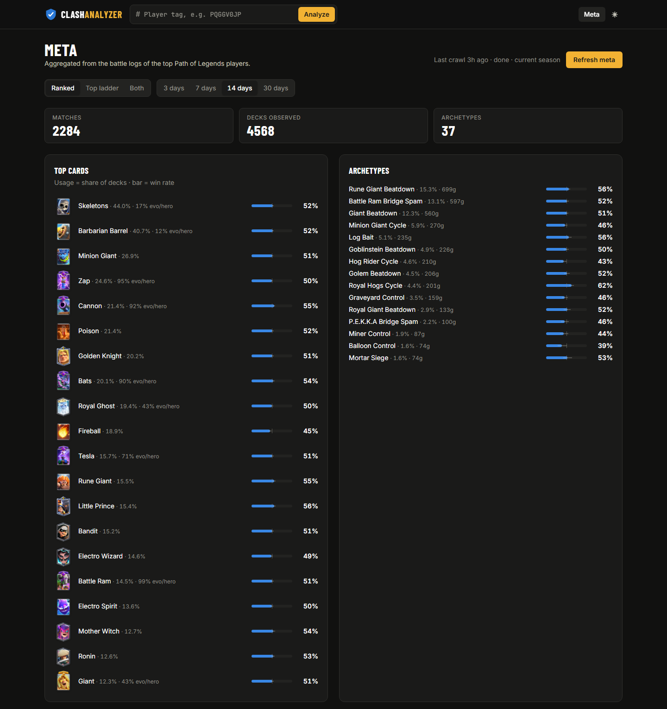

# Clash Analyzer

A Clash Royale progress tracker, upgrade planner, battle analytics dashboard and meta comparison, built on the official Clash Royale API.

The API has no memory: the battlelog keeps only the last ~30 games, and profiles only show the current state. Clash Analyzer polls tracked players in the background and stores every battle and a profile snapshot, so history and trends build up over time. It then computes things the game doesn't show you.

<p align="center"></p>

## Features

<p align="center"></p>

**Battle analytics**
- **Tilt detection:** your win rate after a win, after a loss, and after 2+ losses in a row.
- **Session fatigue:** win rate by game number within a session.
- **Levels vs skill:** win rate by card-level gap, and the share of losses where you were underleveled.
- **Elixir leaked vs result.**
- **Close games vs blowouts.**
- **Evo / Hero advantage.**
- **Nemesis and prey cards.**
- **Opponent archetypes.**
- **Your decks, cards and tower troops.**
- **Best hour and weekday to play.**
- **Plain-English insights.** Every rate comes with a 95% Wilson interval, and insights only appear when the sample is large enough.

**Progress tracker**
- A trophy path rebuilt from every stored battle.
- Snapshot trends: collection level, mastery levels, average card level.
- Day and week deltas.

<p align="center"></p>

**Upgrade planner**
- Gold and copies needed to bring your deck to level 13–16.
- Which cards you play have enough copies to upgrade, cheapest first.
- What's closest to its next level, and your card levels compared to your opponents'.
- The full collection, sortable.

<p align="center"></p>

**Mastery and achievements**
- Every mastery badge mapped to its card, sorted by what's closest to the next level.

**Meta comparison**
- A crawl of the top 100 Path of Legends players' battlelogs, with card usage and win rates, archetypes, and top decks.
- **vs Meta:** how your cards perform at the top, similar top decks, and swap ideas.

<table>
<tr>
<td width="50%"></td>
<td width="50%"></td>
</tr>
</table>

**Clans**
- Members with activity (days since last seen), donations, and live river race fame and decks used today.

**Other**
- Any player tag works. Clan members link through to their profiles.

**Not possible with this API:** replays, card placement coordinates, elixir curves over time. The official API only exposes battle results, and replays exist only inside the game client.

## Stack

| | |
|---|---|
| Backend | Python 3.12, FastAPI, httpx (async), SQLModel on SQLite, APScheduler, managed with **uv** |
| Frontend | Vite, React 19, TypeScript (strict), Tailwind v4, Recharts, TanStack Query, React Router |
| Quality | pytest (112 tests, 95% coverage, recorded real API fixtures), ruff; Vitest + Testing Library, oxlint, tsc |

## Setup

1. **Get an API key.** Create one at <https://developer.clashroyale.com> and whitelist your public IP.
   - If your IP changes often, whitelist `45.79.218.79` instead and set `CR_API_BASE=https://proxy.royaleapi.dev/v1`.
2. **Configure the backend.** Copy `backend/.env.example` to `backend/.env` and fill in `CR_API_KEY`. The `.env` file is gitignored.
3. **Start the backend** (port 8000):
   ```sh
   cd backend
   uv sync
   uv run clash-analyzer
   ```
4. **Start the frontend** (port 5173; it proxies `/api` to the backend):
   ```sh
   cd frontend
   npm install
   npm run dev
   ```

Then open <http://localhost:5173>, enter a tag, and press **Track** so the player is polled every 15 minutes. The meta crawl runs automatically about 30 seconds after startup and then daily. You can also trigger it from the Meta page.

## Tests and checks

```sh
cd backend
uv run pytest --cov
uv run ruff check .
uv run ruff format --check .

cd frontend
npm test
npm run typecheck
npm run lint
npm run build
```

## API

The interactive API docs are at <http://127.0.0.1:8000/docs>. The main routes:

| Route | What |
|---|---|
| `GET /api/players/{tag}` | Profile summary. Refreshes from the API if older than 2 minutes. |
| `POST /api/players/{tag}/track` · `DELETE …/track` | Start or stop background polling |
| `POST /api/players/{tag}/refresh` | Force a refresh |
| `GET /api/players/{tag}/analytics?mode=&days=&tz=` | The full analytics report |
| `GET /api/players/{tag}/progress` | Snapshots, trophy path, deltas |
| `GET /api/players/{tag}/upgrades?target_level=` | Upgrade plan |
| `GET /api/players/{tag}/mastery` | Mastery, badges, achievements |
| `GET /api/players/{tag}/battles` | Stored battles (paginated) |
| `GET /api/players/{tag}/meta-compare` | Your deck vs the meta |
| `GET /api/meta` · `GET /api/meta/status` · `POST /api/meta/refresh` | Meta stats and crawl control |
| `GET /api/clans/{tag}` | Clan and river race overview |

`API_REFERENCE.md` documents every Clash Royale API endpoint and quirk this project relies on.

## Notes

- **Upgrade costs:** the API doesn't expose them. `domain/cards.py` holds the post Level-16 (Nov 2025) table, verified against the published totals.
- **Archetype names:** these are deterministic community-style labels (`domain/archetypes.py`). They describe a deck's shape, not its quality.

---

Not affiliated with, endorsed, sponsored or specifically approved by Supercell. Supercell is not responsible for it. See Supercell's Fan Content Policy.
